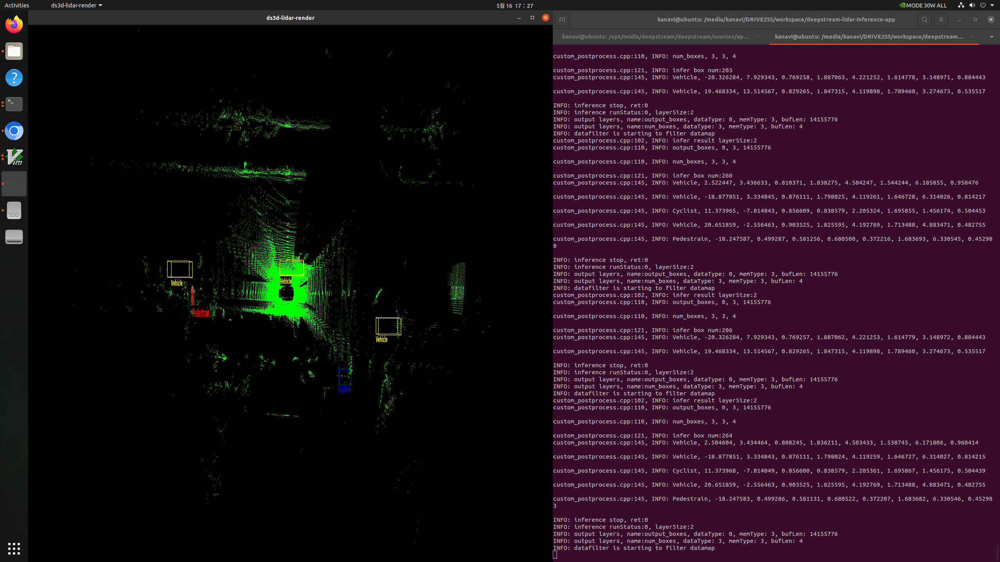
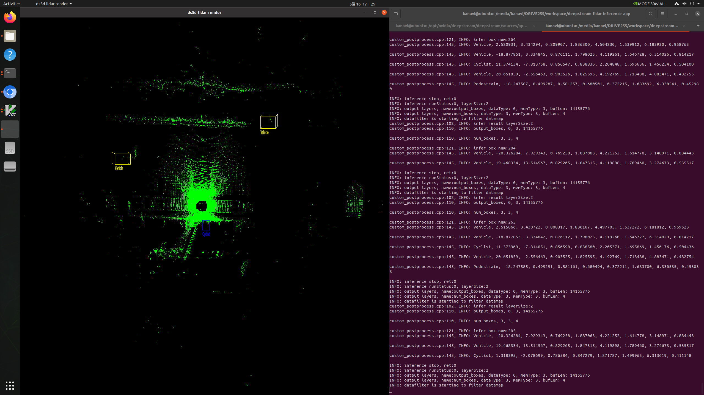
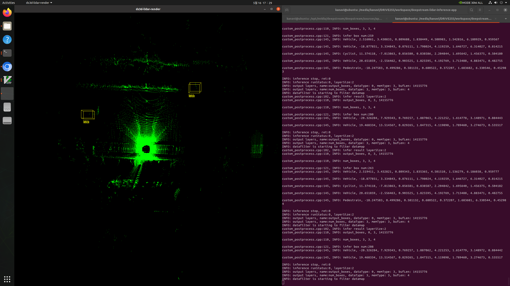

# deepstream-lidar-inference-app

- jetson agx xavier 32GB EVM
- deepstream-6.2
- CUDA 11.4

## setup ENV

```bash
cd /opt/nvidia/deepstream/deepstream/samples
sudo ./triton_backend_setup.sh

# install libs
sudo apt-get install libgstreamer-plugins-base1.0-dev libgstreamer1.0-dev libgstrtspserver-1.0-dev libx11-dev libyaml-cpp-dev

cd /opt/nvidia/deepstream/deepstream/source/apps/sample-apps/deepstream-lidar-inference-app
cd tritonserver
sudo ./build_engine.sh
```

## build

```bash
cd /opt/nvidia/deepstream/deepstream/source/apps/sample-apps/deepstream-lidar-inference-app
sudo make
sudo make install

sudo mkdir datas
```

## RUN

```bash
sudo ./deepstream-lidar-inference-app -c configs/config_lidar_triton_infer.yaml

deepstream-lidar-inference -c configs/config_lidar_source_triton_render.yaml
```

## Result

### configs/config_lidar_triton_infer.yaml

```
kanavi@ubuntu:/media/kanavi/DRIVE255/workspace/deepstream-lidar-inference-app$ sudo ./deepstream-lidar-inference-app -c configs/config_lidar_triton_infer.yaml 
[sudo] password for kanavi: 
/opt/nvidia/deepstream/deepstream-6.2/sources/libs/ds3d/gst/custom_lib_factory.h:58, INFO: Library Opened Successfully
/opt/nvidia/deepstream/deepstream-6.2/sources/libs/ds3d/gst/custom_lib_factory.h:68, INFO: Custom Context created from createLidarFileLoader
INFO: LidarFileSource dataloader is starting
/opt/nvidia/deepstream/deepstream-6.2/sources/libs/ds3d/gst/custom_lib_factory.h:58, INFO: Library Opened Successfully
/opt/nvidia/deepstream/deepstream-6.2/sources/libs/ds3d/gst/custom_lib_factory.h:68, INFO: Custom Context created from createLidarFileDataRender
INFO: lidar file datarender is starting
INFO: Library Opened Successfully
INFO: Custom Context created from createLidarInferenceFilter
INFO: lidarinference datafilter is starting
INFO: modelInputs name:points, dataType:FP32, ndataType:0, numDims:3, numElements:819200
INFO: modelInputs name:num_points, dataType:INT32, ndataType:3, numDims:1, numElements:1
INFO: customPreprocessLibPath:/opt/nvidia/deepstream/deepstream/lib/libnvds_lidar_custom_preprocess_impl.so
INFO: memPoolSize: 2
INFO: gpuid: 0
INFO: filterInputDatamapKey: DS3D::LidarXYZI
INFO: inputTensorMemType: 1
INFO: customPreprocessLibHandle: 0xaaaae8b981d0
INFO: customPreprocessFuncName: CreateInferServerCustomPreprocess
INFO: nvinferserverCfg: triton_mode_CAPI.txt
INFO: configPath: configs/config_lidar_triton_infer.yaml
INFO: new nvinferserverCfg: configs/triton_mode_CAPI.txt
INFO: get preprocess callback suc
I0516 08:25:51.000826 9187 pinned_memory_manager.cc:240] Pinned memory pool is created at '0x20361a000' with size 67108864
I0516 08:25:51.001831 9187 cuda_memory_manager.cc:105] CUDA memory pool is created on device 0 with size 67108864
I0516 08:25:51.009615 9187 server.cc:563] 
+------------------+------+
| Repository Agent | Path |
+------------------+------+
+------------------+------+

I0516 08:25:51.009885 9187 server.cc:590] 
+---------+------+--------+
| Backend | Path | Config |
+---------+------+--------+
+---------+------+--------+

I0516 08:25:51.010026 9187 server.cc:633] 
+-------+---------+--------+
| Model | Version | Status |
+-------+---------+--------+
+-------+---------+--------+

I0516 08:25:51.010733 9187 tritonserver.cc:2264] 
+----------------------------------+----------------------------------------------------------------------------------------+
| Option                           | Value                                                                                  |
+----------------------------------+----------------------------------------------------------------------------------------+
| server_id                        | triton                                                                                 |
| server_version                   | 2.30.0                                                                                 |
| server_extensions                | classification sequence model_repository model_repository(unload_dependents) schedule_ |
|                                  | policy model_configuration system_shared_memory cuda_shared_memory binary_tensor_data  |
|                                  | statistics trace logging                                                               |
| model_repository_path[0]         | /media/kanavi/DRIVE255/workspace/deepstream-lidar-inference-app/tritonserver/models    |
| model_control_mode               | MODE_EXPLICIT                                                                          |
| strict_model_config              | 1                                                                                      |
| rate_limit                       | OFF                                                                                    |
| pinned_memory_pool_byte_size     | 67108864                                                                               |
| cuda_memory_pool_byte_size{0}    | 67108864                                                                               |
| response_cache_byte_size         | 0                                                                                      |
| min_supported_compute_capability | 5.3                                                                                    |
| strict_readiness                 | 1                                                                                      |
| exit_timeout                     | 30                                                                                     |
+----------------------------------+----------------------------------------------------------------------------------------+

I0516 08:25:51.018922 9187 model_lifecycle.cc:459] loading: pointpillars:1
I0516 08:25:51.212180 9187 tensorrt.cc:64] TRITONBACKEND_Initialize: tensorrt
I0516 08:25:51.212328 9187 tensorrt.cc:74] Triton TRITONBACKEND API version: 1.11
I0516 08:25:51.212391 9187 tensorrt.cc:80] 'tensorrt' TRITONBACKEND API version: 1.11
I0516 08:25:51.212447 9187 tensorrt.cc:104] backend configuration:
{"cmdline":{"auto-complete-config":"false","min-compute-capability":"5.300000","backend-directory":"/opt/nvidia/deepstream/deepstream-6.2/lib/triton_backends","default-max-batch-size":"4"}}
I0516 08:25:51.214277 9187 tensorrt.cc:211] TRITONBACKEND_ModelInitialize: pointpillars (version 1)
I0516 08:25:51.218712 9187 tensorrt.cc:260] TRITONBACKEND_ModelInstanceInitialize: pointpillars_0 (GPU device 0)
I0516 08:25:52.973930 9187 logging.cc:49] Loaded engine size: 8 MiB
I0516 08:25:55.908751 9187 logging.cc:49] [MemUsageChange] Init cuBLAS/cuBLASLt: CPU +260, GPU +248, now: CPU 531, GPU 5865 (MiB)
I0516 08:25:56.625403 9187 logging.cc:49] [MemUsageChange] Init cuDNN: CPU +82, GPU +85, now: CPU 613, GPU 5950 (MiB)
I0516 08:25:56.631121 9187 logging.cc:49] [MemUsageChange] TensorRT-managed allocation in engine deserialization: CPU +0, GPU +8, now: CPU 0, GPU 8 (MiB)
I0516 08:25:56.634372 9187 logging.cc:49] [MemUsageChange] Init cuBLAS/cuBLASLt: CPU +0, GPU +0, now: CPU 597, GPU 5950 (MiB)
I0516 08:25:56.637361 9187 logging.cc:49] [MemUsageChange] Init cuDNN: CPU +0, GPU +0, now: CPU 597, GPU 5950 (MiB)
I0516 08:25:56.731208 9187 logging.cc:49] [MemUsageChange] TensorRT-managed allocation in IExecutionContext creation: CPU +0, GPU +348, now: CPU 0, GPU 356 (MiB)
I0516 08:25:56.736875 9187 instance_state.cc:188] Created instance pointpillars_0 on GPU 0 with stream priority 0 and optimization profile default[0];
I0516 08:25:56.738088 9187 model_lifecycle.cc:694] successfully loaded 'pointpillars' version 1
INFO: TrtISBackend id:1 initialized model: pointpillars
deepstream_lidar_infer_main.cpp:441, INFO: Play...
INFO: Lidar source read completely, return EOS
INFO: Lidar source read completely, return EOS
INFO: datafilter is starting to filter datamap
custom_postprocess.cpp:102, INFO: infer result layerSize:2
custom_postprocess.cpp:110, INFO: output_boxes, 0, 3, 14155776

custom_postprocess.cpp:110, INFO: num_boxes, 3, 3, 4

custom_postprocess.cpp:121, INFO: infer box num:204
custom_postprocess.cpp:145, INFO: Vehicle, -20.326284, 7.929343, 0.769257, 1.887062, 4.221253, 1.614779, 3.148972, 0.884443

custom_postprocess.cpp:145, INFO: Vehicle, 19.468334, 13.514567, 0.829265, 1.847315, 4.119898, 1.789460, 3.274673, 0.535517

custom_postprocess.cpp:145, INFO: Cyclist, 1.316854, -2.074542, 0.789245, 0.836680, 1.885385, 1.503406, 6.308034, 0.423077

INFO: inference stop, ret:0
INFO: inference runStatus:0, layerSize:2
INFO: output layers, name:output_boxes, dataType: 0, memType: 3, bufLen: 14155776
INFO: output layers, name:num_boxes, dataType: 3, memType: 3, bufLen: 4
INFO: lidar file datarender prerollImpl
INFO: lidar file datarender render datamap
INFO: render frame name /media/kanavi/DRIVE255/workspace/deepstream-lidar-inference-app/configs/../datas/lidar_frame_0_0.bin bytes 504
INFO: datafilter is starting to filter datamap
custom_postprocess.cpp:102, INFO: infer result layerSize:2
custom_postprocess.cpp:110, INFO: output_boxes, 0, 3, 14155776

custom_postprocess.cpp:110, INFO: num_boxes, 3, 3, 4

custom_postprocess.cpp:121, INFO: infer box num:267
custom_postprocess.cpp:145, INFO: Vehicle, 2.513603, 3.431750, 0.809037, 1.840218, 4.502129, 1.544554, 6.178164, 0.959706

custom_postprocess.cpp:145, INFO: Vehicle, -18.877851, 3.334845, 0.876111, 1.798025, 4.119261, 1.646728, 6.314026, 0.814216

custom_postprocess.cpp:145, INFO: Cyclist, 11.374117, -7.813860, 0.856584, 0.838586, 2.204828, 1.695636, 1.456375, 0.504188

custom_postprocess.cpp:145, INFO: Vehicle, 20.651859, -2.556463, 0.903525, 1.825595, 4.192769, 1.713488, 4.883471, 0.482755

custom_postprocess.cpp:145, INFO: Pedestrain, -18.247587, 0.499287, 0.581256, 0.680501, 0.372216, 1.683693, 6.330543, 0.452980

INFO: inference stop, ret:0
INFO: inference runStatus:0, layerSize:2
INFO: output layers, name:output_boxes, dataType: 0, memType: 3, bufLen: 14155776
INFO: output layers, name:num_boxes, dataType: 3, memType: 3, bufLen: 4
INFO: lidar file datarender render datamap
INFO: render frame name /media/kanavi/DRIVE255/workspace/deepstream-lidar-inference-app/configs/../datas/lidar_frame_1_4000000.bin bytes 840
ds3dfilter EOS received
INFO: datafilter is flushing
INFO: lidar file datarender flushImpl
deepstream_lidar_infer_main.cpp:169, INFO: End of stream

INFO: lidar file datarender stopImpl
INFO: datafilter is closing
I0516 08:25:57.456435 9187 tensorrt.cc:298] TRITONBACKEND_ModelInstanceFinalize: delete instance state
I0516 08:25:57.465202 9187 server.cc:264] Waiting for in-flight requests to complete.
I0516 08:25:57.465311 9187 server.cc:280] Timeout 30: Found 0 model versions that have in-flight inferences
I0516 08:25:57.465372 9187 server.cc:295] All models are stopped, unloading models
I0516 08:25:57.465453 9187 server.cc:302] Timeout 30: Found 1 live models and 0 in-flight non-inference requests
I0516 08:25:57.477976 9187 tensorrt.cc:237] TRITONBACKEND_ModelFinalize: delete model state
I0516 08:25:57.479726 9187 model_lifecycle.cc:579] successfully unloaded 'pointpillars' version 1
I0516 08:25:58.465659 9187 server.cc:302] Timeout 29: Found 0 live models and 0 in-flight non-inference requests
INFO: LidarFileSource dataloader is closing
```

### config/config_lidar_source_triton_render.yaml

- blanking output display UI
- why?






